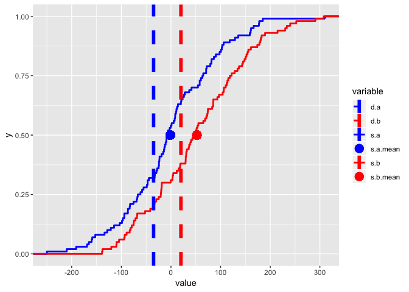
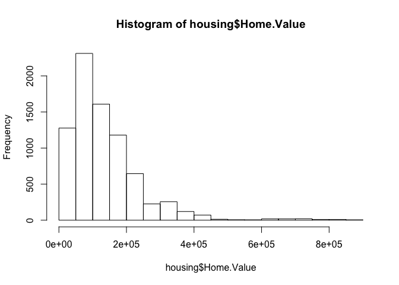
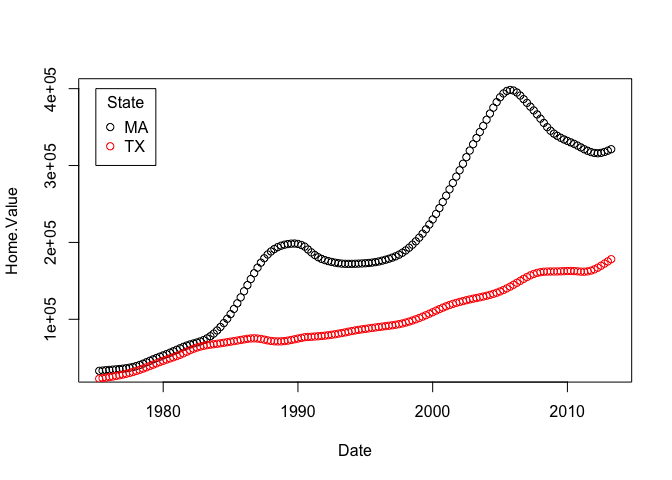
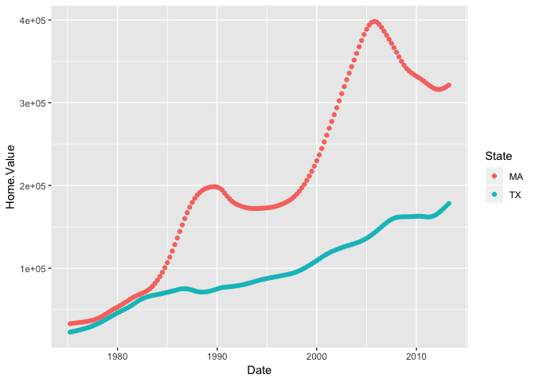
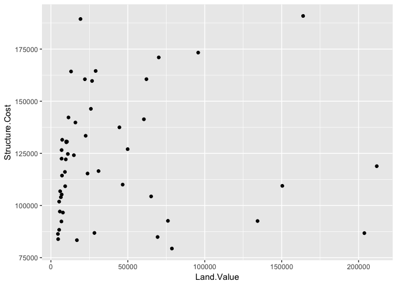
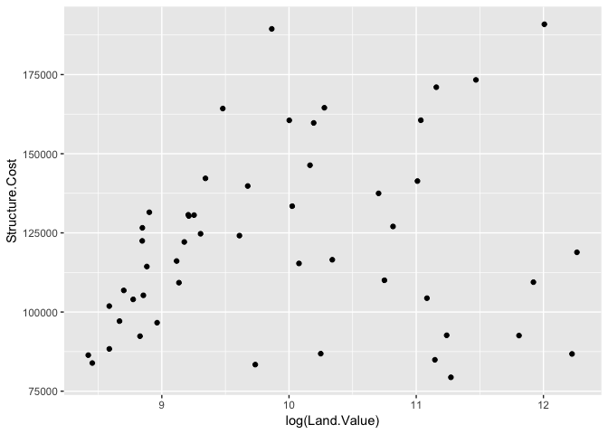
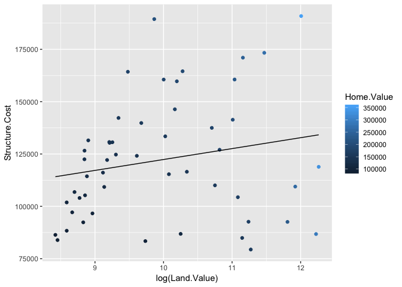
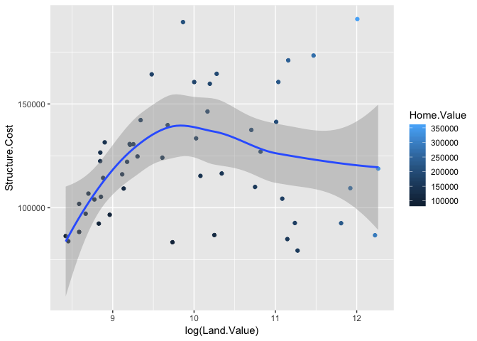

### Required packages


```r
require(ggplot2)
```

```
## Loading required package: ggplot2
```

```r
require(reshape2)
```

```
## Loading required package: reshape2
```


### From an online post

This was from an online answer that I think I searched when working with the unknown B sample to do fpkm analysis and drawing plots. Helped me with having multiple data points on lines


```r
s.a = rnorm(100)*100
s.b = rnorm(100)*100+50
d.a = -35
d.b = 20
sdata = data.frame(cbind(s.a,s.b))
ddata = data.frame(cbind(d.a,d.b))
sdata.m = melt(sdata)
```

```
## No id variables; using all as measure variables
```

```r
ddata.m = melt(ddata)
```

```
## No id variables; using all as measure variables
```

```r
ggplot(sdata.m, aes(x=value, color=variable,linetype=variable,shape=variable))+
  stat_ecdf(size=1)+
  geom_vline(data=ddata.m,
             aes(xintercept = value,color=variable,linetype=variable,shape=variable),
             size=2) +
  geom_point(aes(x=mean(sdata.m$value[sdata.m$variable=="s.a"]),
                 color="s.a.mean",linetype="s.a.mean",shape="s.a.mean",
                 y=.5),size = 5) +
  geom_point(aes(x=mean(sdata.m$value[sdata.m$variable=="s.b"]),
                 color="s.b.mean",linetype="s.b.mean",shape="s.b.mean",
                 y=.5),size = 5) +
  scale_shape_manual(breaks=c("d.a","d.b","s.a","s.a.mean","s.b","s.b.mean"),
                     values=c(16,16,16,16,16,16)) +
  scale_color_manual(breaks=c("d.a","d.b","s.a","s.a.mean","s.b","s.b.mean"),
                     values=c("blue","red","blue","blue","red","red"))+
  scale_linetype_manual(breaks=c("d.a","d.b","s.a","s.a.mean","s.b","s.b.mean"),
                        values=c(2,2,1,0,1,0))+
  guides(color=guide_legend(override.aes=list(shape=c(NA,NA,NA,16,NA,16))))
```

```
## Warning: Ignoring unknown aesthetics: shape
```

```
## Warning: Ignoring unknown aesthetics: linetype

## Warning: Ignoring unknown aesthetics: linetype
```

<!-- -->

### Following this https://tutorials.iq.harvard.edu/R/Rgraphics/Rgraphics.html. 

Note: It is not possible to do interactive graphics with ggplot.

1. Simple graphs


```r
housing <- read.csv("~/Documents/UMCCR/Play/Play/ggplot/Rgraphics/dataSets/landdata-states.csv")
head(housing[1:5])
```

```
##   State region    Date Home.Value Structure.Cost
## 1    AK   West 2010.25     224952         160599
## 2    AK   West 2010.50     225511         160252
## 3    AK   West 2009.75     225820         163791
## 4    AK   West 2010.00     224994         161787
## 5    AK   West 2008.00     234590         155400
## 6    AK   West 2008.25     233714         157458
```

```r
#Base graphics histogram
hist(housing$Home.Value)
```

<!-- -->

```r
# Using ggplot
ggplot(housing, aes(x = Home.Value)) +
  geom_histogram()
```

```
## `stat_bin()` using `bins = 30`. Pick better value with `binwidth`.
```

<!-- -->

Clearly base produced a better histogram

2. More complex graphs

Base colored scatter plot example


```r
plot(Home.Value ~ Date,
     data=subset(housing, State == "MA"))
points(Home.Value ~ Date, col="red",
       data=subset(housing, State == "TX"))
legend(1975, 400000,
       c("MA", "TX"), title="State",
       col=c("black", "red"),
       pch=c(1, 1))
```

<!-- -->

ggplot colored scatter plot example


```r
ggplot(subset(housing, State %in% c("MA", "TX")),
       aes(x=Date,
           y=Home.Value,
           color=State))+
  geom_point()
```

<!-- -->

ggplot wins clearly.

3. Geometric objects and aesthetics

Starting with points i.e. scatterplot


```r
hp2001Q1 <- subset(housing, Date == 2001.25) 
ggplot(hp2001Q1,
       aes(y = Structure.Cost, x = Land.Value)) +
  geom_point()
```

<!-- -->


```r
ggplot(hp2001Q1,
       aes(y = Structure.Cost, x = log(Land.Value))) +
  geom_point()
```

<!-- -->

4. Lines and Prediction lines

A plot constructed with ggplot can have more than one geom. In that case the mappings established in the ggplot() call are plot defaults that can be added to or overridden. Our plot could use a regression line:


```r
hp2001Q1$pred.SC <- predict(lm(Structure.Cost ~ log(Land.Value), data = hp2001Q1))

p1 <- ggplot(hp2001Q1, aes(x = log(Land.Value), y = Structure.Cost))

p1 + geom_point(aes(color = Home.Value)) +
  geom_line(aes(y = pred.SC))
```

<!-- -->

*Smoothers*

Not all geometric objects are simple shapes–the smooth geom includes a line and a ribbon.


```r
p1 +
  geom_point(aes(color = Home.Value)) +
  geom_smooth()
```

```
## `geom_smooth()` using method = 'loess'
```

<!-- -->

