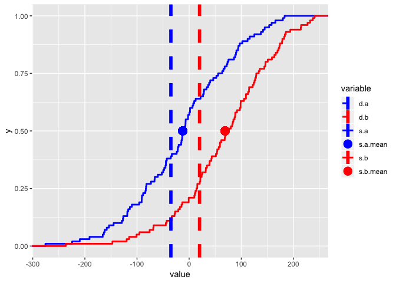
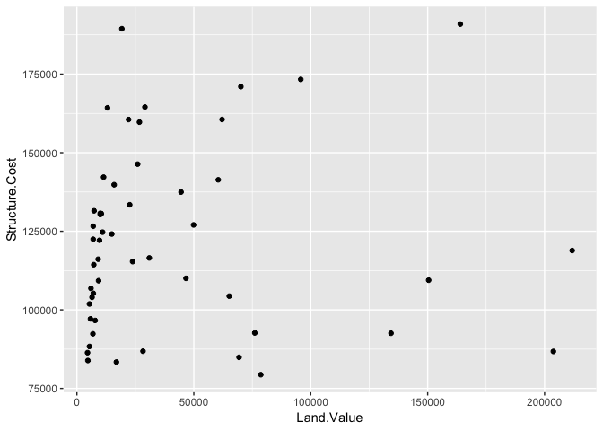
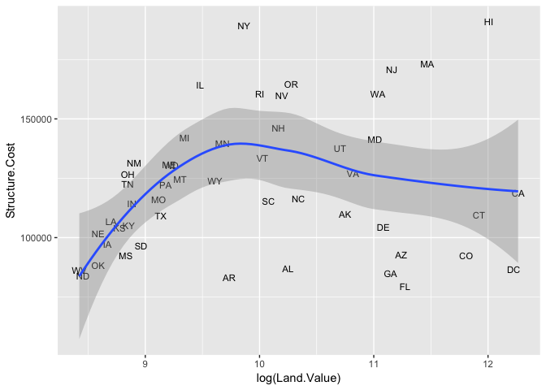
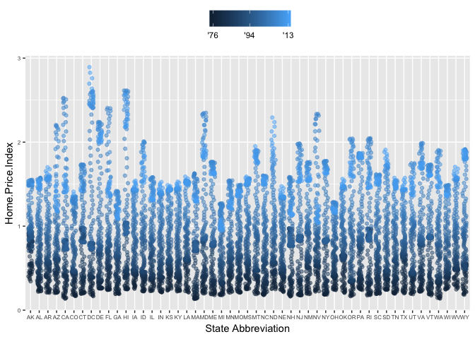
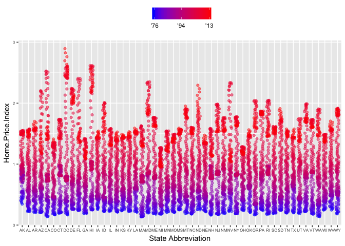

### Required packages


```r
require(ggplot2)
```

```
## Loading required package: ggplot2
```

```r
require(reshape2)
```

```
## Loading required package: reshape2
```


### From an online post

This was from an online answer that I think I searched when working with the unknown B sample to do fpkm analysis and drawing plots. Helped me with having multiple data points on lines


```r
s.a = rnorm(100)*100
s.b = rnorm(100)*100+50
d.a = -35
d.b = 20
sdata = data.frame(cbind(s.a,s.b))
ddata = data.frame(cbind(d.a,d.b))
sdata.m = melt(sdata)
```

```
## No id variables; using all as measure variables
```

```r
ddata.m = melt(ddata)
```

```
## No id variables; using all as measure variables
```

```r
ggplot(sdata.m, aes(x=value, color=variable,linetype=variable,shape=variable))+
  stat_ecdf(size=1)+
  geom_vline(data=ddata.m,
             aes(xintercept = value,color=variable,linetype=variable,shape=variable),
             size=2) +
  geom_point(aes(x=mean(sdata.m$value[sdata.m$variable=="s.a"]),
                 color="s.a.mean",linetype="s.a.mean",shape="s.a.mean",
                 y=.5),size = 5) +
  geom_point(aes(x=mean(sdata.m$value[sdata.m$variable=="s.b"]),
                 color="s.b.mean",linetype="s.b.mean",shape="s.b.mean",
                 y=.5),size = 5) +
  scale_shape_manual(breaks=c("d.a","d.b","s.a","s.a.mean","s.b","s.b.mean"),
                     values=c(16,16,16,16,16,16)) +
  scale_color_manual(breaks=c("d.a","d.b","s.a","s.a.mean","s.b","s.b.mean"),
                     values=c("blue","red","blue","blue","red","red"))+
  scale_linetype_manual(breaks=c("d.a","d.b","s.a","s.a.mean","s.b","s.b.mean"),
                        values=c(2,2,1,0,1,0))+
  guides(color=guide_legend(override.aes=list(shape=c(NA,NA,NA,16,NA,16))))
```

```
## Warning: Ignoring unknown aesthetics: shape
```

```
## Warning: Ignoring unknown aesthetics: linetype

## Warning: Ignoring unknown aesthetics: linetype
```

<!-- -->

### Following this https://tutorials.iq.harvard.edu/R/Rgraphics/Rgraphics.html. 

Note: It is not possible to do interactive graphics with ggplot.

1. Simple graphs


```r
housing <- read.csv("~/Documents/UMCCR/Play/Play/ggplot/Rgraphics/dataSets/landdata-states.csv")
head(housing[1:5])
```

```
##   State region    Date Home.Value Structure.Cost
## 1    AK   West 2010.25     224952         160599
## 2    AK   West 2010.50     225511         160252
## 3    AK   West 2009.75     225820         163791
## 4    AK   West 2010.00     224994         161787
## 5    AK   West 2008.00     234590         155400
## 6    AK   West 2008.25     233714         157458
```

```r
#Base graphics histogram
hist(housing$Home.Value)
```

<!-- -->

```r
# Using ggplot
ggplot(housing, aes(x = Home.Value)) +
  geom_histogram()
```

```
## `stat_bin()` using `bins = 30`. Pick better value with `binwidth`.
```

<!-- -->

Clearly base produced a better histogram

2. More complex graphs

Base colored scatter plot example


```r
plot(Home.Value ~ Date,
     data=subset(housing, State == "MA"))
points(Home.Value ~ Date, col="red",
       data=subset(housing, State == "TX"))
legend(1975, 400000,
       c("MA", "TX"), title="State",
       col=c("black", "red"),
       pch=c(1, 1))
```

<!-- -->

ggplot colored scatter plot example


```r
ggplot(subset(housing, State %in% c("MA", "TX")),
       aes(x=Date,
           y=Home.Value,
           color=State))+
  geom_point()
```

<!-- -->

ggplot wins clearly.

3. Geometric objects and aesthetics

Starting with points i.e. scatterplot


```r
hp2001Q1 <- subset(housing, Date == 2001.25) 
ggplot(hp2001Q1,
       aes(y = Structure.Cost, x = Land.Value)) +
  geom_point()
```

<!-- -->


```r
ggplot(hp2001Q1,
       aes(y = Structure.Cost, x = log(Land.Value))) +
  geom_point()
```

<!-- -->

4. Lines and Prediction lines

A plot constructed with ggplot can have more than one geom. In that case the mappings established in the ggplot() call are plot defaults that can be added to or overridden. Our plot could use a regression line:


```r
hp2001Q1$pred.SC <- predict(lm(Structure.Cost ~ log(Land.Value), data = hp2001Q1))

p1 <- ggplot(hp2001Q1, aes(x = log(Land.Value), y = Structure.Cost))

p1 + geom_point(aes(color = Home.Value)) +
  geom_line(aes(y = pred.SC))
```

<!-- -->

*Smoothers*
Not all geometric objects are simple shapes–the smooth geom includes a line and a ribbon.


```r
p1 +
  geom_point(aes(color = Home.Value)) +
  geom_smooth()
```

```
## `geom_smooth()` using method = 'loess' and formula 'y ~ x'
```

<!-- -->

*Text label points*
Each geom accepts a particualar set of mappings–for example geom_text() accepts a labels mapping.


```r
p1 + 
  geom_text(aes(label=State), size = 3) +
  geom_smooth()
```

```
## `geom_smooth()` using method = 'loess' and formula 'y ~ x'
```

<!-- -->

5. Aesthetic mapping VS assignment

Note that variables are mapped to aesthetics with the aes() function, while fixed aesthetics are set outside the aes() call. This sometimes leads to confusion, as in this example:


```r
p1 +
  geom_point(aes(size = 2),# incorrect! 2 is not a variable
             color="red") # this is fine -- all points red
```

<!-- -->

*Mapping variables to other aesthetics*

Other aesthetics are mapped in the same way as x and y in the previous example.


```r
p1 +
  geom_point(aes(color=Home.Value, shape = region))
```

```
## Warning: Removed 1 rows containing missing values (geom_point).
```

<!-- -->

### Statistical Transformations

Some plot types (such as scatterplots) do not require transformations–each point is plotted at x and y coordinates equal to the original value. Other plots, such as boxplots, histograms, prediction lines etc. require statistical transformations:

- for a boxplot the y values must be transformed to the median and 1.5(IQR)
- for a smoother smother the y values must be transformed into predicted values

*Setting Statistical Transformation Arguments*

Arguments to stat_ functions can be passed through geom_ functions. This can be slightly annoying because in order to change it you have to first determine which stat the geom uses, then determine the arguments to that stat.

For example, here is the default histogram of Home.Value:


```r
p2 <- ggplot(housing, aes(x = Home.Value))
p2 + geom_histogram()
```

```
## `stat_bin()` using `bins = 30`. Pick better value with `binwidth`.
```

<!-- -->

This graph looks reasonable but we can change defaults to make it more presenatble.


```r
p2 + geom_histogram(stat = "bin", binwidth=4000)
```

<!-- -->

### Changing the Statistical Transformation

Sometimes the default statistical transformation is not what you need. This is often the case with pre-summarized data:


```r
housing.sum <- aggregate(housing["Home.Value"], housing["State"], FUN=mean)
rbind(head(housing.sum), tail(housing.sum))
```

```
##    State Home.Value
## 1     AK  147385.14
## 2     AL   92545.22
## 3     AR   82076.84
## 4     AZ  140755.59
## 5     CA  282808.08
## 6     CO  158175.99
## 46    VA  155391.44
## 47    VT  132394.60
## 48    WA  178522.58
## 49    WI  108359.45
## 50    WV   77161.71
## 51    WY  122897.25
```

This code `ggplot(housing.sum, aes(x=State, y=Home.Value)) + geom_bar()` won't work. What is the problem with the previous plot? Basically we take binned and summarized data and ask ggplot to bin and summarize it again (remember, geom_bar defaults to stat = stat_count); obviously this will not work. 

We can fix it by telling geom_bar to use a different statistical transformation function:


```r
ggplot(housing.sum, aes(x=State, y=Home.Value)) + 
  geom_bar(stat="identity")
```

<!-- -->

### Scales: Controlling Aesthetic Mapping

Aesthetic mapping (i.e., with aes()) only says that a variable should be mapped to an aesthetic. It doesn’t say how that should happen. For example, when mapping a variable to shape with aes(shape = x) you don’t say what shapes should be used. Similarly, aes(color = z) doesn’t say what colors should be used. Describing what colors/shapes/sizes etc. to use is done by modifying the corresponding scale. In ggplot2 scales include

* position
* color and fill
* size
* shape
* line type

Scales are modified with a series of functions using a scale_<aesthetic>_<type> naming scheme. Try typing scale_<tab> to see a list of scale modification functions.

*Common Scale Arguments*

The following arguments are common to most scales in ggplot2:

* name: the first argument gives the axis or legend title
* limits: the minimum and maximum of the scale
* breaks: the points along the scale where labels should appear
* labels: the labels that appear at each break

Specific scale functions may have additional arguments; for example, the `scale_color_continuous` function has arguments `low` and `high` for setting the colors at the low and high end of the scale.

*Scale Modification Examples*

Start by constructing a dotplot showing the distribution of home values by Date and State.


```r
p3 <- ggplot(housing,
             aes(x = State,
                 y = Home.Price.Index)) + 
        theme(legend.position="top",
              axis.text=element_text(size = 6))
(p4 <- p3 + geom_point(aes(color = Date),
                       alpha = 0.5,
                       size = 1.5,
                       position = position_jitter(width = 0.25, height = 0)))
```

<!-- -->

Now modify the breaks for the x axis and color scales


```r
p4 + scale_x_discrete(name="State Abbreviation") +
  scale_color_continuous(name="",
                         breaks = c(1976, 1994, 2013),
                         labels = c("'76", "'94", "'13"))
```

<!-- -->

Next change the low and high values to blue and red:


```r
p4 +
  scale_x_discrete(name="State Abbreviation") +
  scale_color_continuous(name="",
                         breaks = c(1976, 1994, 2013),
                         labels = c("'76", "'94", "'13"),
                         low = "blue", high = "red")
```

<!-- -->
